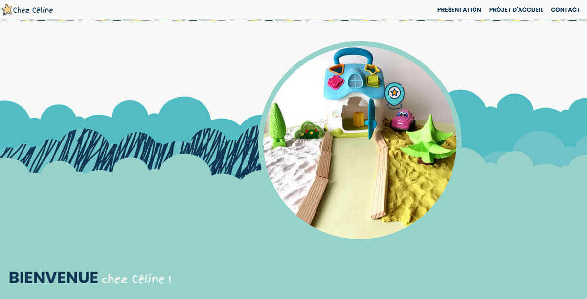

# Site Web de Céline Hubert - Assistante Maternelle Agréée

Bienvenue sur le site web de Céline Hubert, assistante maternelle agréée. Ce site présente mes services de garde d'enfants, mon projet d'accueil personnalisé, et fournit des moyens de contact pour les parents intéressés.

## Contenu du Site

### 1. Page d'Accueil - `index.html`
La page d'accueil introduit les services de garde d'enfants et l'accueil personnalisé que j'offre, incluant des informations sur mon parcours, ma façon de travailler, et les avantages de mon mode d'accueil.

**Contenu:**
- Présentation de mon parcours professionnel et de ma reconversion dans la petite enfance.
- Description de mon environnement de travail et des interactions avec mes propres enfants.
- Avantages de mon mode d'accueil, incluant l'attention personnalisée et les sorties quotidiennes.
- Explications sur les aides financières et les avantages fiscaux liés à l'emploi d'une assistante maternelle agréée.

### 2. Page Projet d'Accueil - `projet-accueil.html`
Cette page détaille mon projet d'accueil, incluant les activités proposées, et les valeurs éducatives que je souhaite transmettre aux enfants. Informations sur les conditions d'accueil et les modalités d'adaptation.

### 3. Page de Contact - `contact.html`
La page de contact contient un formulaire permettant aux parents de me contacter directement pour des renseignements ou pour convenir d'un rendez-vous, ainsi qu'une carte pour localiser le lieu d'accueil.

### 4. Page Mentions Légales - `mentions-legales.html`
Cette page informe les visiteurs sur les mentions légales obligatoires, incluant la propriété intellectuelle, la protection des données personnelles, les cookies, les liens externes et la responsabilité.

## Fonctionnalités
- **Accueil personnalisé:** Chaque enfant bénéficie d'une attention individuelle.
- **Sorties et activités extérieures:** Quotidiennes pour favoriser l'épanouissement.
- **Communication directe:** Lien direct avec les parents pour une meilleure coordination.
- **Sociabilisation:** Participation au Relais Petite Enfance (RPE) pour développer les compétences sociales des enfants.
- **Accompagnement administratif:** Aide dans les démarches administratives et informations sur les aides financières disponibles.

## Utilisation des Images
Les graphismes utilisés sur ce site, y compris les photos personnelles, sont soumises aux droits d'auteur de Céline Hubert. Toute utilisation ou exploitation des images sans autorisation est strictement interdite.

## Contact
Pour toute question ou demande d'informations supplémentaires, veuillez me contacter via le formulaire disponible sur la [page de contact](https://chubert91assmat.netlify.app/contact.html).

Merci de votre visite !

---

© 2024 Céline Hubert - Assistante Maternelle agréée.
